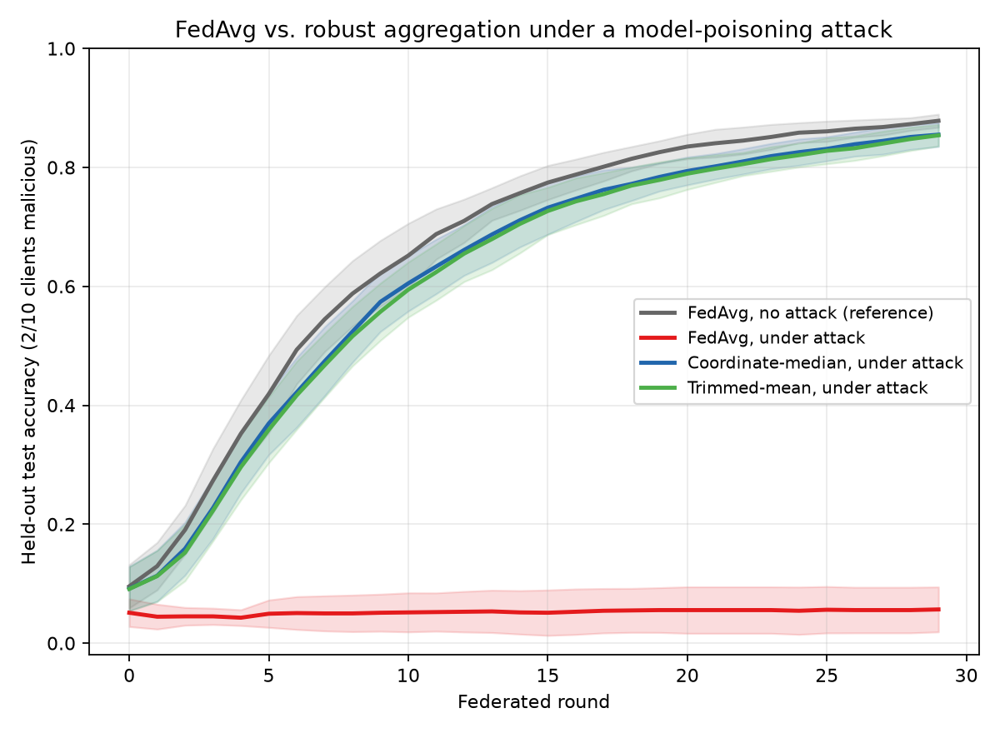
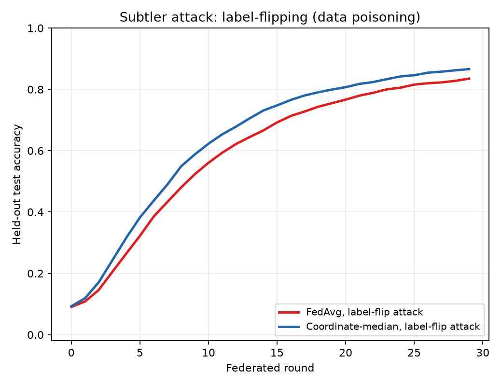

# Robust Federated Averaging: Surviving a Poisoning Client

A small, from-scratch experiment: several simulated clients train one shared
model via federated learning; one or more clients are **malicious** and try
to poison the global model; a **Byzantine-robust aggregation rule**
(coordinate-wise median / trimmed mean) resists the attack where plain
FedAvg collapses.

No GPU, no deep learning framework — just NumPy and scikit-learn, runs in
under two minutes on a laptop CPU.



## The result, in one sentence

With 2 of 10 clients malicious, plain **FedAvg collapses from 88% to 6%
accuracy**; **coordinate-wise median recovers to 86%** — within 2 points of
the no-attack baseline — using the exact same clients, data, and attack.

| Scenario | Final accuracy (mean ± std, 5 seeds) |
|---|---|
| FedAvg, no attack (reference) | 0.878 ± 0.011 |
| **FedAvg, under attack** | **0.057 ± 0.038** |
| Coordinate-median, under attack | 0.855 ± 0.020 |
| Trimmed-mean, under attack | 0.854 ± 0.018 |

## Why this happens (the short version)

Federated averaging (FedAvg) combines client updates with a plain weighted
**mean**. A mean has no limit on how far a single bad input can drag it — one
client reporting an extreme value pulls the average arbitrarily far, no
matter how many honest clients disagree. This repo's attacker exploits
exactly that: it trains normally, then **reports the opposite of its honest
update, scaled up 8x** ("boosted sign-flip"), every round.

A **coordinate-wise median** (or a **trimmed mean**, which drops the most
extreme values before averaging) doesn't have this problem: as long as fewer
than half the clients are malicious, the median coordinate is guaranteed to
land on an honest value, no matter how extreme the attacker's report is.
That's the whole mechanism — no cryptography, no anomaly detection model,
just a different reduction operator on the same reported updates.

## A subtler attack, for context

Model/update poisoning (above) is a strong, easy-to-spot attack. The repo
also includes **label-flipping** (a data-poisoning attack: the malicious
client trains normally, just on relabeled data), which produces
updates that don't look like statistical outliers — only their *direction*
is wrong. This is harder for any aggregator to catch on magnitude alone,
and the results show it: FedAvg barely dents (83.5% vs. 87.8% baseline),
and coordinate-median doesn't dramatically outperform it here (86.6%). This
is included deliberately, so the repo doesn't overstate what robust
aggregation solves — it defends well against attacks that manifest as
statistical outliers, not against every conceivable form of poisoning.



## Setup

- **Dataset**: `sklearn.datasets.load_digits` — 1,797 real 8x8 handwritten
  digit images, 10 classes. Ships inside scikit-learn, so there's no
  download step and the experiment is 100% reproducible offline.
- **Clients**: 10, IID split of the training data (federated averaging's
  own robustness/non-robustness to non-IID data is a different, well-studied
  question — this repo isolates the poisoning question by keeping the data
  split simple).
- **Model**: a small MLP (`64 → 64 → 10`), trained with `MLPClassifier` in
  `partial_fit` mode so the federated loop can read and overwrite its
  weights directly each round — no custom autodiff needed.
- **Attackers**: clients `0` and `1` (2 of 10, 20%) — configurable.
- **Rounds**: 30 federated rounds, 1 local epoch per client per round.
- **Seeds**: every number above is a mean ± std over 5 seeds (`0`–`4`).

## Run it yourself

```bash
git clone <this-repo-url>
cd robust-fedavg-demo
pip install -r requirements.txt
python3 run_experiment.py
```

Reproduces `results/metrics.json` and both figures in `figures/` in about
90 seconds on a standard CPU. Every run is seeded, so re-running gives
identical numbers.

Run the unit tests (aggregation math only, no ML, <1 second):

```bash
python3 -m pytest tests/ -v
```

## Repository layout

```
src/
  data.py          Loads digits, splits IID across N clients.
  model.py         MLP wrapper: get/set weights as flat NumPy arrays.
  client.py        Honest local training + two attack implementations
                    (sign_flip, label_flip).
  aggregation.py   fedavg / coordinate_median / trimmed_mean — the core
                    of the whole repo, ~70 lines.
  server.py        The federated round loop: broadcast, collect, aggregate,
                    evaluate.
run_experiment.py  Runs every scenario across 5 seeds, saves figures + JSON.
tests/
  test_aggregation.py  Fast, ML-free correctness checks on the aggregation
                        math (does the median actually resist an outlier?).
figures/           Generated plots (committed, so they render on GitHub
                    without anyone needing to run anything).
results/           Generated metrics.json (committed for the same reason).
.github/workflows/tests.yml   CI: runs the unit tests on every push/PR.
```

## Tweaking the experiment

Everything interesting is a constant at the top of `run_experiment.py`:

```python
N_CLIENTS = 10
N_MALICIOUS = 2           # try 4 or 5 to see robust aggregation start to strain
N_ROUNDS = 30
MALICIOUS_IDS = tuple(range(N_MALICIOUS))
```

and the attack strength lives in `src/client.py`'s `sign_flip_update(...,
boost=8.0)`. A few things worth trying:

- Push `N_MALICIOUS` toward 5/10 (50%) — coordinate-median's guarantee
  breaks down exactly at that boundary; you should see it start to degrade.
- Lower `boost` toward 1.0 — a weaker attack is a smaller edge for the
  robust aggregator to detect, and FedAvg's collapse should become less
  total.
- Add a third aggregation rule (e.g. Krum, or a simple cosine-similarity
  filter) to `src/aggregation.py`'s `STRATEGIES` dict — the server loop
  doesn't need any changes to pick it up.

## Limitations (stated plainly)

- This is a small, IID, IID-friendly demo dataset — it isolates the
  poisoning/robustness question cleanly, but doesn't speak to how these
  methods behave under the *combination* of non-IID data and an attacker
  (an honest client's legitimately unusual update and a malicious client's
  update can be harder to tell apart there).
- Coordinate-median and trimmed-mean assume a minority of malicious clients
  and no collusion between them; a coordinated attack designed around the
  aggregator's specific breakdown point is a different, harder problem.
- `boost=8.0` is a strong, clearly-anomalous attack by design, to make the
  mechanism legible. The label-flip results above are the more honest
  picture of a subtler attacker.

## License

MIT — see [LICENSE](LICENSE).
